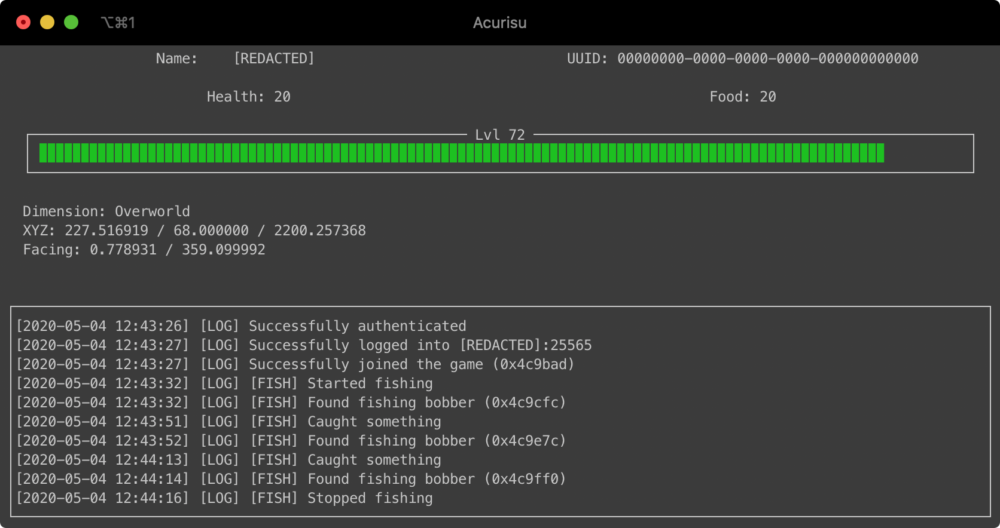

# CancerCraft

CancerCraft is a wrapper based on [pyCraft](https://github.com/ammaraskar/pyCraft) that should make coding [Minecraft](https://www.minecraft.net) [bots](https://en.wikipedia.org/wiki/Software_agent) with [Python](https://www.python.org) easier and more organised.

> **Note:** CancerCraft has fully moved to Microsoft login and does not support Mojang accounts anymore.

## Installation

You have to have at least Python 3.5 and Pip installed.

Install the Python module requirements using `pip3 install -r requirements.txt`

#### Note
As this uses default [Python curses](https://docs.python.org/3/howto/curses.html), it is not (yet) compatible with Windows. Either remove all curses related code or use the [Windows Subsystem for Linux](https://docs.microsoft.com/en-us/windows/wsl/install-win10).

### Microsoft login

The bot requires Azure app credentials which request the needed claims from the users. One does not need to do this for every account. Here's a short guide on creating an Azure app.

1. Visit https://portal.azure.com/ and log in.
2. Select `App registrations` under `All services` or use the search functionality.
3. Press `new Registration`:
    1. Choose a name which the people will see logging in later.
    2. Set `Supported account types` to `Personal Microsoft accounts only`.
    3. In `Redirect URI` select `Web` and enter `http://localhost:6969`. One can freely choose the port but keep in mind to set `--redirect-port` if it deviates from the default.
    4. `Register`.    
4. Select `Authentication`:
    1. Tick `Access tokens (used for implicit flows)`.
    2. `Save`. 
5. Select `Certificates & secrets`:
    1. Press `New client secret`.
    2. Choose a name.
    3. `Add`.
    4. Save the `Value` somewhere.
6. The `Application (client) ID` can be found in `Overview`.

A more detailed explanation can be found [here](https://docs.microsoft.com/en-us/azure/active-directory/develop/quickstart-register-app).

### Set-Up
As this is based on pyCraft you need to clone (or download) it. Only the `minecraft` folder is required. Since pyCraft does not have all packets implemented, you have to add additional ones yourself. Helpful resources are [Current Protocol Specification](https://wiki.vg/Protocol) and [MC Dev Data](https://joodicator.github.io/mc-dev-data/). It would be nice to contribute created packet implementations to [pyCraft](https://github.com/ammaraskar/pyCraft).

This wrapper requires one additional packet:
```python
class SetExperiencePacket(Packet):
    @staticmethod
    def get_id(context):
        return 0x51 if context.protocol_version >= 755 else \
               0x48 if context.protocol_version >= 721 else \
               0x49 if context.protocol_version >= 707 else \
               0x48 if context.protocol_version >= 550 else \
               0x47 if context.protocol_version >= 471 else \
               0x43 if context.protocol_version >= 461 else \
               0x44 if context.protocol_version >= 451 else \
               0x43 if context.protocol_version >= 389 else \
               0x42 if context.protocol_version >= 352 else \
               0x41 if context.protocol_version >= 345 else \
               0x40 if context.protocol_version >= 336 else \
               0x3F if context.protocol_version >= 318 else \
               0x3D if context.protocol_version >= 70 else \
               0x1f

    packet_name = 'set experience'
    definition = [
        {'experience_bar': Float},
        {'level': VarInt},
        {'total_experience': VarInt}
    ]
```
Add it to [`minecraft/networking/packets/clientbound/play/__init__.py`](https://github.com/ammaraskar/pyCraft/blob/master/minecraft/networking/packets/clientbound/play/__init__.py). Don't forget to extend `packets` at the top of the file.
```python
def get_packets(context):
    packets = {
        ...,
        SetExperiencePacket
    }
```

## Usage

Execute `python3 main.py -h` for help or just run `python3 main.py` for it to guide you through the process.

I would advise against providing your client secret directly as an argument as it will be logged in your [shell](https://en.wikipedia.org/wiki/Command-line_interface)'s [command history](https://en.wikipedia.org/wiki/Command_history). Most shells however support not logging a command if you add a leading space.

Press `q` to quit and use the arrow keys (up and down) or the scroll wheel to [scroll](https://en.wikipedia.org/wiki/Scrolling) the output [pad](https://docs.python.org/3/howto/curses.html#windows-and-pads) up and down.

## Screenshot(s)




## Bot
To create a bot, simply make a new python file and create a [class](https://docs.python.org/3/tutorial/classes.html#class-objects) called `Bot`.

Keybinds can be set by creating a [class / instance variable](https://docs.python.org/3/tutorial/classes.html#class-and-instance-variables) called `keys` which is a [dict](https://docs.python.org/3/tutorial/datastructures.html#dictionaries) that maps a key returned by [getkey](https://docs.python.org/3/library/curses.html#curses.window.getkey) to a function.

To listen to a certain packet, add the corresponding method to your class.
Currently available methods:
```python
login_success
join_game
disconnect
player_position_and_lock
respawn
chat_message
set_experience
update_health
spawn_object
entity_position_delta
destroy_entities
sound_effect
entity_teleport
```

#### Example
```python
class Bot:
    def __init__(self):
        ...

    def login_success(self, packet):
        ...
```
### Problems
Currently, only predefined methods that are linked to packets can be used in the `Bot` definition. Feel free to open an issue or make a pull request if you need one that is missing.

### Ready-to-use Bot(s)
#### [Fisher](./bots/Fisher.py)
The fisher requires two additional packets:
```python
class DestroyEntitiesPacket(Packet):
    @staticmethod
    def get_id(context):
        return 0x3A if context.protocol_version >= 756 else \
               0x36 if context.protocol_version >= 741 else \
               0x37 if context.protocol_version >= 721 else \
               0x38 if context.protocol_version >= 550 else \
               0x37 if context.protocol_version >= 471 else \
               0x35 if context.protocol_version >= 461 else \
               0x36 if context.protocol_version >= 451 else \
               0x35 if context.protocol_version >= 389 else \
               0x34 if context.protocol_version >= 352 else \
               0x33 if context.protocol_version >= 345 else \
               0x32 if context.protocol_version >= 336 else \
               0x31 if context.protocol_version >= 332 else \
               0x32 if context.protocol_version >= 318 else \
               0x30 if context.protocol_version >= 70 else \
               0x13

    packet_name = 'destroy entities'

    fields = 'count', 'entity_ids'
    
    def read(self, file_object):
        self.count = VarInt.read(file_object)
        self.entity_ids = []
        for i in range(self.count):
            self.entity_ids.append(VarInt.read(file_object))

class EntityTeleportPacket(Packet):
    @staticmethod
    def get_id(context):
        return 0x62 if context.protocol_version >= 757 else \
               0x61 if context.protocol_version >= 755 else \
               0x56 if context.protocol_version >= 721 else \
               0x57 if context.protocol_version >= 550 else \
               0x56 if context.protocol_version >= 471 else \
               0x51 if context.protocol_version >= 461 else \
               0x52 if context.protocol_version >= 451 else \
               0x51 if context.protocol_version >= 441 else \
               0x50 if context.protocol_version >= 389 else \
               0x4F if context.protocol_version >= 352 else \
               0x4E if context.protocol_version >= 345 else \
               0x4D if context.protocol_version >= 343 else \
               0x4C if context.protocol_version >= 336 else \
               0x4B if context.protocol_version >= 318 else \
               0x49 if context.protocol_version >= 110 else \
               0x4A if context.protocol_version >= 94 else \
               0x48 if context.protocol_version >= 70 else \
               0x18

    packet_name = 'entity teleport'
    definition = [
        {'entity_id': VarInt},
        {'x': Double},
        {'y': Double},
        {'z': Double},
        {'yaw': Angle},
        {'pitch': Angle},
        {'on_ground': Boolean}
    ]
```
They can be added with the same procedure as mentioned above.

To start/stop [fishing](https://minecraft.gamepedia.com/Fishing) press `f`.

## Thanks
- Huge thanks to [Ammar Askar](https://github.com/ammaraskar) for [pyCraft](https://github.com/ammaraskar/pyCraft)

## License
[MIT](https://choosealicense.com/licenses/mit/)